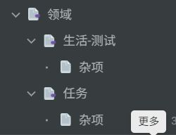
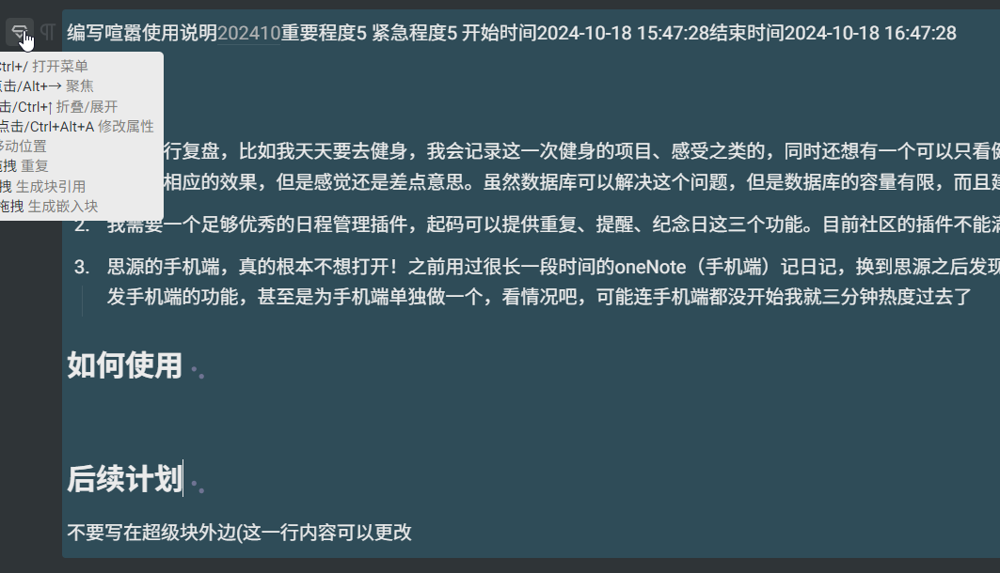
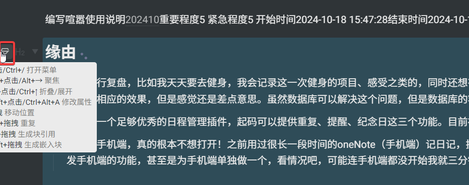
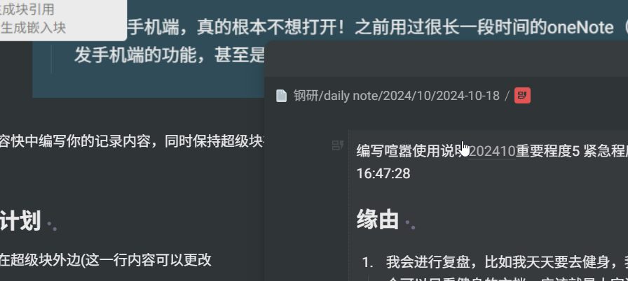

# Instructions

## Reason

1. I will review, for example, I will go to the gym every day, I will record this time of fitness projects, feelings and so on, and also want to have a document that can only look at fitness, which should be the diary stream and MOC, although you can achieve the corresponding effect through labels and bookmarks, but the feeling is still almost interesting. Although the database can solve this problem, the capacity of the database is limited, and the establishment of too many databases is not easy to maintain.
2. I need a good enough schedule management plug-in that can provide at least three functions: repetition, reminder and anniversary. The current community plugins don't meet my needs
3. I really don't want to open the mobile end of Siyuan! I used oneNote (mobile terminal) to keep a diary for a long time before, and I found that I didn't want to open the source after changing to the source, I don't know why. Therefore, I will have a considerable amount of energy to develop the functions of the mobile phone, or even make a separate one for the mobile phone, depending on the situation, I may not even start the mobile phone in three minutes

## How to use

> Before use: Using plug-ins will automatically create more documents
>
> Preview notice: The current preview version, after the modification is basically unlikely to be compatible with the present, a simple experience is good, **do not use heavily!**

Once the plugin has been downloaded and enabled, click the button at the top to open the plugin

After opening the plugin, you will be taken to the Settings page, select a notebook, and then you can see the other directories

> Currently there is nothing on the homepage
>
> Calendar can only jump to the corresponding date document, if no, it will be created

When you create a new domain in the domain, the system creates a category by default, Miscellaneous, and the plug-in automatically creates the domain document in the notebook root directory

Clicking Add data will append a superblock to the document corresponding to Miscellaneous, which I call the event block

A complete transaction block is a superblock that consists of three blocks: a title block, an information block, and a content block

> **⚠️ Note:**  Please do not do anything that may cause the ID of the event block, title block, information block, or content block to change, because the plug-in obtains the block by ID

Please write your record in the Content folder, while keeping the superblock present and the ID unchanged, that is, do not delete automatically created superblocks

The event block is embedded in the journal document corresponding to the start time

## Follow-up plan

Please click [blatant siyuan plug-in](https://github.com/users/kuangdongksk/projects/5)
